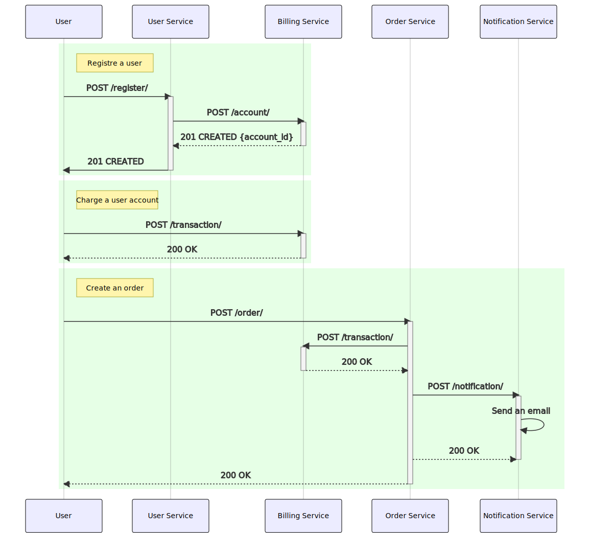
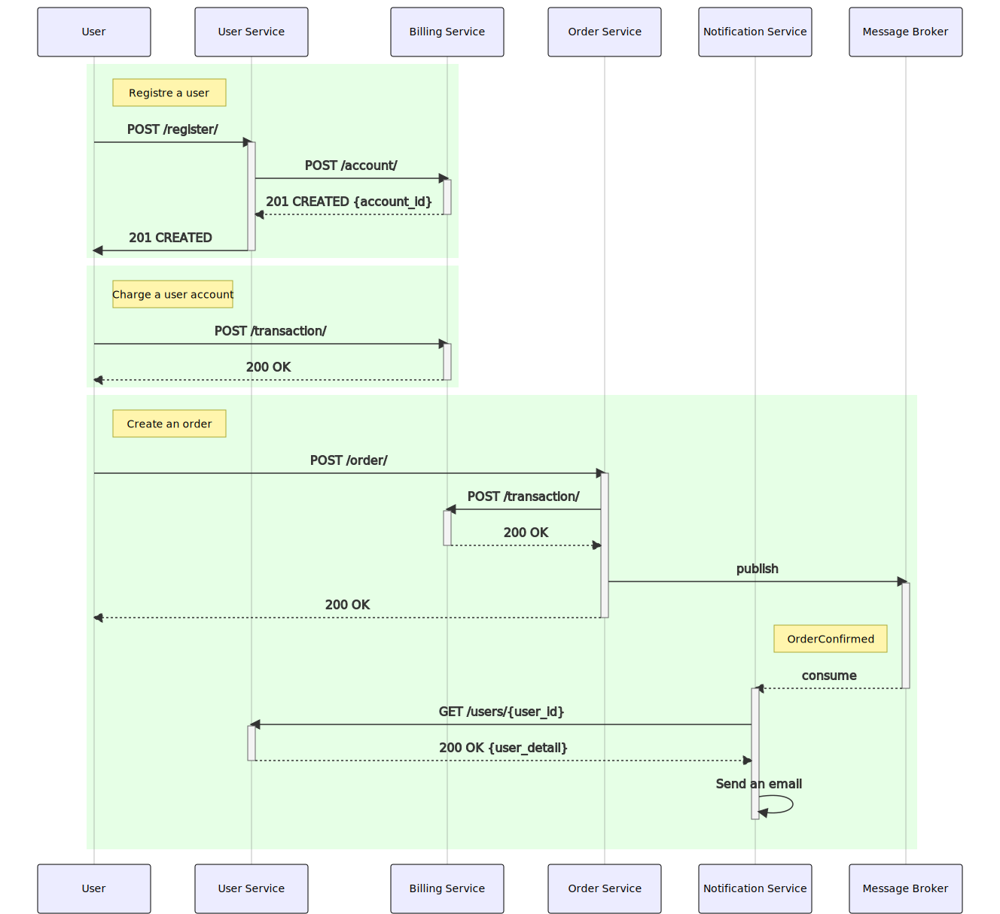
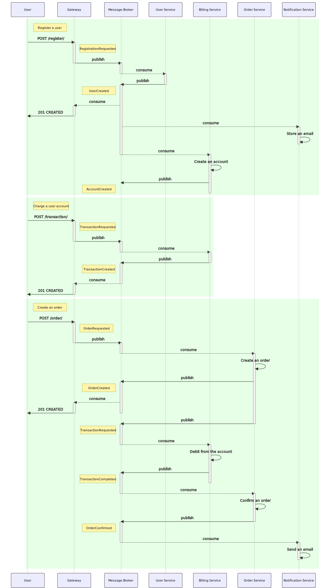

# otusapistreamprocessing

# Теория

## HTTP взаимодействие

[Описание REST интерфейсов](http://petstore.swagger.io/?url=https://raw.githubusercontent.com/adalekin/otusstreamprocessing/master/doc/http-communication/rest-openapi.yaml)

Преимущества:
* Простота реализации.

Недостатки:
* В момент создания заказа пользователь ожидает ответа от `Notification Service`.
* Ошибки `Notification Service` могут повлиять на стабильность и производительность создания заказа.



## Событийное взаимодействие с использование брокера сообщений для нотификаций (уведомлений)

[Описание REST интерфейсов](http://petstore.swagger.io/?url=https://raw.githubusercontent.com/adalekin/otusstreamprocessing/master/doc/http-communication/rest-openapi.yaml)

[Описание ASYNC интерфейсов](./doc/mb-notifications/asyncapi.yaml)

Преимущества:
* Простота реализации.

Недостатки:
* Повышенная нагрузка на чтение данных из других сервисов.
* `Notification Service` перегружен коммуникациями. Со временем это скажется на его производительности и расширяемости.



## Event Collaboration cтиль взаимодействия с использованием брокера сообщений

[Описание ASYNC интерфейсов](./doc/event-collaboration/asyncapi.yaml)

Преимущества:
* Гибкое решение, которое позволит относительно легко вносить изменения в логику работы системы.

Недостатки:
* Сложность реализации и эксплуатации.
* Необходимо поддерживать целостность данных.



# Prerequisites

* Kubernetes 1.21.2
* Helm 3.6.3
* Istio 1.10.3
* Skaffold

# Run

## Add Helm repos

```
helm repo add bitnami https://charts.bitnami.com/bitnami
helm repo add kiali https://kiali.org/helm-charts
helm repo add jaeger https://jaegertracing.github.io/helm-charts
helm repo add prometheus https://prometheus-community.github.io/helm-charts
```

## Run with Skaffold

```
skaffold run
```

# Tests

```
newman run users-auth.postman_collection.json
```
